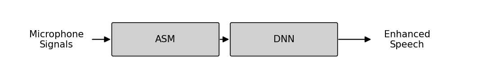
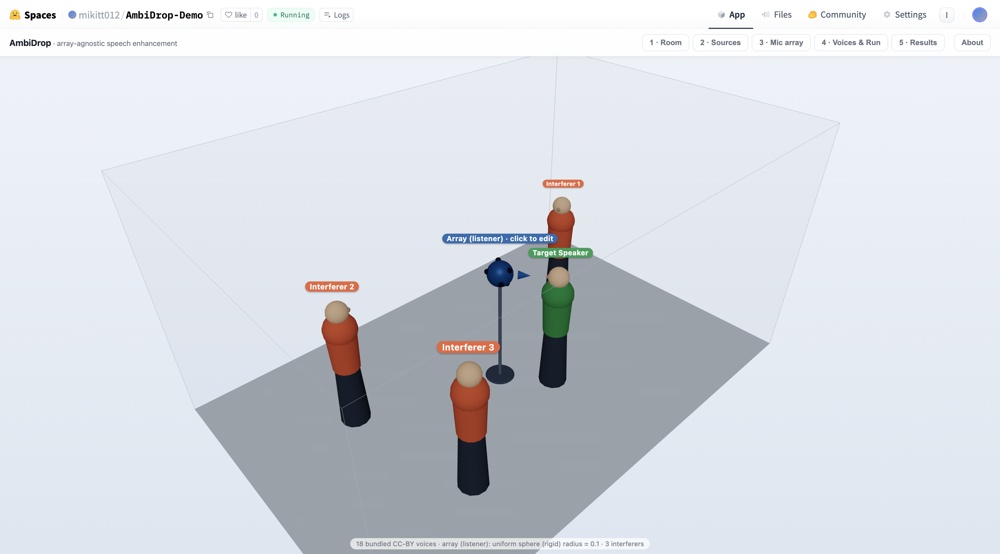
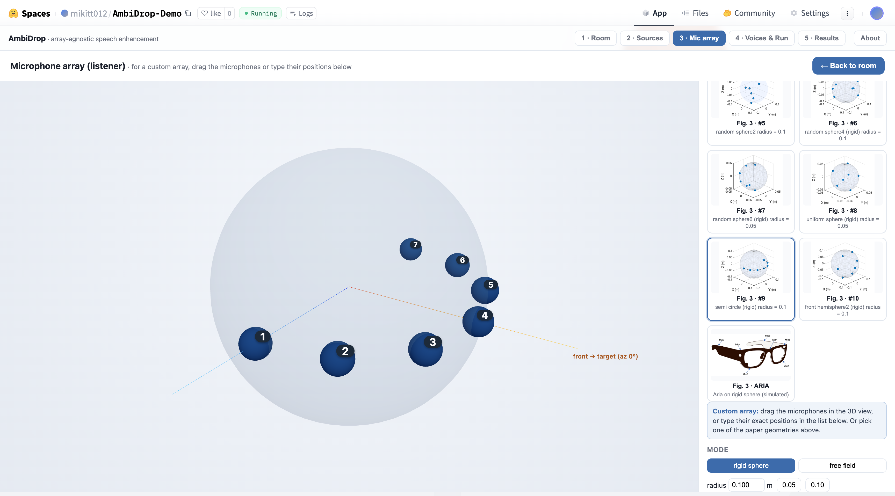
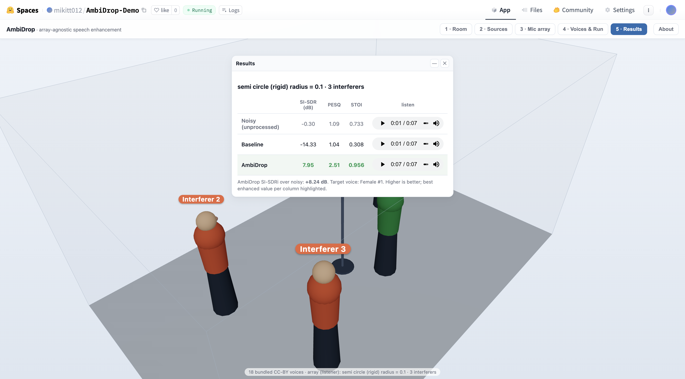

# AmbiDrop: Ambisonics-Based Array-Agnostic Neural Speech Enhancement


<p align="center">


</p>

<p align="center">
  <strong>Train once. Enhance speech on arbitrary microphone arrays.</strong>
</p>

<p align="center">
  <a href="https://arxiv.org/abs/2607.00548">📄 Paper</a> •
  <a href="https://huggingface.co/spaces/mikitt012/AmbiDrop-Demo">🤗 Interactive Demo</a>
</p>

_Last updated: 2026-07-13_

Standard multichannel speech enhancement models are typically trained and evaluated on a fixed microphone array geometry, which often limits their ability to generalize to unseen arrays.

AmbiDrop addresses this limitation by training the DNN exclusively on **ideal Ambisonics**, an array-independent spherical harmonic (SH) representation of the sound field, instead of raw microphone signals.

During training, a channel-wise dropout layer randomly suppresses some of the Ambisonics channels. This mimics the degraded or near-zero channels that may arise when Ambisonics Signal Matching (ASM) reconstructs the sound field from arbitrary microphone arrays, reducing the train/inference domain mismatch.

During inference, microphone signals from any supported array geometry are encoded into the Ambisonics domain using ASM, and the already-trained model is applied without modification.

> **Key idea:** the DNN never sees raw microphone signals or ASM-encoded signals during training—it learns directly from an idealized, geometry-independent representation of the sound field.

### Highlights

- ✅ Generalizes to unseen microphone array geometries
- ✅ Compatible with multiple DNN architectures
- ✅ Robust to missing microphones
- ✅ Evaluated on both simulated arrays and real Project Aria recordings
- ✅ Maintains competitive performance with substantially smaller networks

**Training**


**Inference**



Two DNN architectures are currently provided:

- **FT-JNF** — stacked BiLSTM processing first frequency then time axes, outputting a complex IRM mask applied to the a₀₀ (omni) channel. Operates in the STFT domain on 9-channel complex SH input (18 real/imag dimensions).
- **IC Conv-TasNet** — Conv1d encoder → dilated TCN with inter-channel attention → ConvTranspose1d decoder. Operates directly in the time domain on 9-channel real ACN SH input.

**Paper:** [AmbiDrop: Ambisonics-Based Array-Agnostic Neural Speech Enhancement](https://arxiv.org/abs/2607.00548)  
**Authors:** Michael Tatarjitzky, Vladimir Tourbabin, Boaz Rafaely

---

## Demo

Try AmbiDrop directly in your browser:

👉 https://huggingface.co/spaces/mikitt012/AmbiDrop-Demo

The interactive demo allows you to:

- create a virtual 3D acoustic scene with a target speaker and interfering speakers,
- position the speakers anywhere in the room,
- choose one of the microphone arrays used in the paper or design your own array geometry,
- select different speech recordings for each speaker,
- run AmbiDrop and hear how the enhancement changes with different array geometries and acoustic scenes.

<p align="center">
  
  
  
</p>

*Example screenshots from the interactive demo.*

---

## Quick Start

Datasets are not included in the repository, so the full pipeline starts from data generation. You will need the [WSJ0 corpus](https://catalog.ldc.upenn.edu/LDC93S6A) and must set `WSJ0_ROOT` in the `# === USER CONFIG ===` block at the top of the wrapper script before running.

```bash
# 1. Install
conda env create -f environment.yml
conda activate venv

# 2. Full pipeline — FT-JNF, AmbiDrop mode (generate → preprocess → train → test)
python run_FT_JNF.py --mode ambidrop --actions generate preprocess train test

# 3. To also run the supervised baseline for comparison
python run_FT_JNF.py --mode both --actions generate preprocess train test

# 4. Evaluate on real Project Aria glasses recordings (requires datasets/aria_ds/)
python run_Real_World.py --atf simulated

# 5. IC Conv-TasNet — same four phases, see differences in run_ConvTasNet.py section below
python run_ConvTasNet.py --mode ambidrop --actions generate preprocess train test
```

To reproduce paper results using the provided checkpoints (no training needed):

```bash
python run_FT_JNF.py --mode both --actions test
python run_ConvTasNet.py --mode ambidrop --actions test
```

The 21 microphone arrays used in the paper are predefined in `datagenerator/paper_arrays.py` (`PAPER_ARRAYS_TRAIN`, `PAPER_ARRAYS_TEST`). Set these in the USER CONFIG block to reproduce the exact paper experiments.

For complete benchmark results and ablation studies, see the paper.

> **Note on reproducibility:** The original paper experiments used a MATLAB-based data generation pipeline. This repository re-implements data generation in Python using the `shroom` library. Even when using identical array geometries and parameters (`PAPER_ARRAYS_TRAIN` / `PAPER_ARRAYS_TEST`), numerical differences in the room simulation and ATF computation mean that reproduced results will be close to but not identical to the published numbers.

---

## Setup

**Conda (recommended):**

```bash
conda env create -f environment.yml
conda activate venv
```

**pip alternative (Python 3.9):**

```bash
pip install -r requirements.txt
```

The `shroom` library (rigid sphere / array ATF simulation) is pulled from GitHub automatically by both methods. To install it manually:

```bash
pip install git+https://github.com/Yhonatangayer/shroom.git
```

Edit the `# === USER CONFIG ===` block at the top of the wrapper you want to run:

```python
# run_FT_JNF.py  (same block exists in run_ConvTasNet.py)
WSJ0_ROOT = "/path/to/wsj0"          # WSJ0 corpus root
DATA_ROOT = "datasets/run_ftjnf"     # generated data goes here
CKPT_DIR  = "checkpoints/FT_JNF"    # newly trained models saved here
```

---

## Wrapper Scripts

### `run_FT_JNF.py` — FT-JNF end-to-end

Two independent axes of control:

**`--mode`**

| Mode | Training input | Test input | Description |
|------|---------------|------------|-------------|
| `ambidrop` | ideal 9-ch complex SH + SHChannelDropout | ASM-encoded SH | AmbiDrop framework |
| `baseline` | 7-ch mic signals | 7-ch mic signals | Standard supervised baseline |
| `both` | runs both in sequence | runs both in sequence | Direct comparison |

**`--actions`** (one or more, executed left-to-right)

| Action | What happens |
|--------|-------------|
| `generate` | Synthesise speech + room simulation → raw `.wav` / `.mat` files |
| `preprocess` | Convert raw files → STFT tensor `.pt` files |
| `train` | Train FT-JNF model, save checkpoint to `CKPT_DIR` |
| `test` | Load checkpoint, evaluate, print SI-SDR / PESQ / STOI |

**Additional flags**

| Flag | Description |
|------|-------------|
| `--checkpoint PATH` | Override checkpoint for test (single mode) |
| `--checkpoint-baseline PATH` | Override baseline checkpoint when `--mode both` |
| `--checkpoint-ambidrop PATH` | Override ambidrop checkpoint when `--mode both` |
| `--test-arrays {test,train,both}` | Which array geometries to evaluate; default `both` |
| `--test-raw-dir-test PATH` | Raw Type-C directory for test arrays |
| `--test-raw-dir-train PATH` | Raw Type-C directory for train arrays; enables train-array evaluation |
| `--legacy-eval-dir PATH` | Evaluate on a pre-existing preprocessed directory |
| `--raw-baseline-train/val PATH` | Existing raw baseline directories (skips generate for those splits) |
| `--raw-ambidrop-train/val PATH` | Existing raw AmbiDrop directories (skips generate for those splits) |
| `--prep-baseline-train/val PATH` | Already-preprocessed directories (skips preprocess) |
| `--prep-ambidrop-train/val PATH` | Already-preprocessed directories (skips preprocess) |
| `--wandb-project / --wandb-entity / --wandb-run-name` | W&B logging config |
| `--no-wandb` | Disable W&B logging |

**Common `--actions` combinations**

```bash
# Full pipeline from scratch
python run_FT_JNF.py --mode ambidrop --actions generate preprocess train test

# Skip generation, use existing raw data
python run_FT_JNF.py --mode ambidrop --actions preprocess train test

# Evaluate only, using pre-existing evaluation directories
python run_FT_JNF.py --mode both --actions test

# Generate fresh data and evaluate with a specific checkpoint (no training)
python run_FT_JNF.py --mode ambidrop --actions generate preprocess test \
    --checkpoint checkpoints/FT_JNF/SH_FT_JNF,2025-12-01_10-08-18.pt

# Baseline-only training + test
python run_FT_JNF.py --mode baseline --actions preprocess train test
```

---

### `run_ConvTasNet.py` — IC Conv-TasNet end-to-end

Same `--mode` and `--actions` structure as `run_FT_JNF.py`. Key differences from the FT-JNF wrapper:
- Preprocessed data is **time-domain real ACN**, not STFT — Conv-TasNet operates on waveforms
- **AmbiDrop test preprocessing encodes ASM on-the-fly** from raw `p.wav` (via `ConvTasNet/preprocess.py`) using a **real** SH matrix, since Conv-TasNet operates on real-valued ACN signals — this differs from the data generation step, which uses complex SH
- **No W&B logging flags** (`--wandb-*`, `--no-wandb` are not available)
- **No `--legacy-eval-dir`**
- **`--test-arrays` defaults to `test`** (not `both`)

```bash
python run_ConvTasNet.py --mode ambidrop --actions generate preprocess train test
```

---

### `run_Real_World.py` — Real-world Aria evaluation

Evaluates FT-JNF on real Project Aria glasses recordings. Architecture is resolved automatically from the checkpoint filename via `CHECKPOINT_REGISTRY`. Three ASM encoding paths are supported:

| Path | How to invoke | Encoder |
|------|--------------|---------|
| Simulated ATF | `--atf simulated` (default) | Tikhonov regularised inversion via `ambidrop/asm.py` at 16 kHz |
| Measured ATF | `--atf measured` | Shroom's ASM class (`load_file → toFreq → ASM → encode_amb`) at 48 kHz, then resampled |
| Precomputed cnm | `--cnm-path FILE` | `apply_asm_filters` from `ambidrop/asm.py`; skips coefficient computation entirely |

**Flags**

| Flag | Default | Description |
|------|---------|-------------|
| `--checkpoint PATH` | preferred AmbiDrop ckpt | FT-JNF checkpoint |
| `--aria-data-dir PATH` | `datasets/aria_ds` | Root directory with scenario subdirectories |
| `--atf {simulated,measured}` | `simulated` | ATF source: rigid-sphere model or measured SOFA |
| `--atf-path PATH` | — | Path to SOFA file when `--atf measured` (convenience alias for `--sofa-path`) |
| `--steering-path PATH` | `datasets/…/Aria on rigid sphere (simulated).mat` | Override steering matrix for simulated ATF |
| `--grid-path PATH` | `datasets/…/Lebvedev2702.mat` | Override quadrature grid for simulated ATF |
| `--sofa-path PATH` | `datasets/aria_ds/aria_atfs_fixed.sofa` | Override path to measured SOFA file |
| `--atf-npy-path PATH` | `datasets/aria_ds/ATF.npy` | Override path to precomputed ATF `.npy` |
| `--cnm-path PATH` | — | Path to precomputed cnm `.npy` (shape `M × nm × F_full`); activates precomputed path |
| `--mode {ambidrop,baseline}` | from registry | Override model type |
| `--scenarios NAME [NAME ...]` | all | Scenario subdirectory names to evaluate |
| `--ref-mic INT` | `3` | 1-based reference mic index (closest to target azimuth) |
| `--regularization {tikhonov,svd}` | `tikhonov` | ASM solver for the simulated ATF path |
| `--output-csv PATH` | — | Save per-scenario results to a CSV file |

```bash
# Simulated ATF — Tikhonov at 16 kHz (default)
python run_Real_World.py --atf simulated

# Measured ATF — shroom ASM class at 48 kHz
python run_Real_World.py --atf measured

# Precomputed cnm — skip coefficient computation
python run_Real_World.py --cnm-path datasets/aria_ds/cnm_shroom.npy
```

To generate `cnm_shroom.npy` from the measured ATF:

```python
import numpy as np
from shroom.encoders.asm import ASM
from shroom.utils.file_utils import load_file

array = load_file("datasets/aria_ds/aria_atfs_fixed.sofa")
array.toFreq()
asm = ASM(sh_order=2, array=array, fs=array.fs)
asm.calculate()
np.save("datasets/aria_ds/cnm_shroom.npy", asm.cnm.data)  # (M, nm, F_full)
```

---

## Data Generation

Data is generated by the three scripts in `datagenerator/`. All types share the same room simulation pipeline: random rooms simulated with `shroom` (a spherical-harmonic extension of `pyroomacoustics`), array ATFs computed by `shroom`, speech from WSJ0. One target speaker is placed at a random position in the room, then the array is rotated so the target lands at azimuth 0 relative to it. Five additional interferers are placed at random positions in the same room. All signals are simulated in the SH domain at order 20 and then truncated to order 2.

| Type | Script | Output files | Used for |
|------|--------|-------------|---------|
| **A — Ideal SH** | `generate_ambidrop_train_ds.py` | `anm.mat` with 9-ch complex SH (`anmt`) + a₀₀ target (`anmtDirect`) | AmbiDrop training / validation |
| **B — Mic signals** | `generate_baseline_train_ds.py` | `p.wav` (7-ch noisy), `pDirect.wav` (7-ch clean) | Baseline training / validation |
| **C — Mic + ASM** | `generate_inference_ds.py` | Type B files + `anmt_array` (ASM-encoded SH) in `anm.mat` | Test evaluation on unseen arrays |

Type C is the primary evaluation format: it tests whether ASM-encoded signals from a physical array can be enhanced by a model trained only on ideal SH (Type A). The array geometries used for generation are defined in the `ARRAYS_TRAIN` / `ARRAYS_TEST` constants in the wrapper's USER CONFIG block.

> **Paper arrays:** The exact 21 microphone arrays used in the paper (10 training + 11 test) are predefined in `datagenerator/paper_arrays.py` as `PAPER_ARRAYS_TRAIN`, `PAPER_ARRAYS_TEST`, and `PAPER_ARRAYS_ALL`. Import these directly and assign them to the `ARRAYS_TRAIN` / `ARRAYS_TEST` config variables in the wrapper scripts to reproduce paper results. The file also includes a `plot_paper_arrays()` function for visualising array geometries.

---

## Code → Paper Mapping

### Core method

| Paper element | Code |
|---|---|
| SH signal model (Section II-B) | `ambidrop/asm.py` — `compute_asm_coefficients`, `encode_ambisonics` |
| Channel dropout mechanism (Section III-C) | `ambidrop/dropouts.py` — `SHChannelDropout` |
| FT-JNF architecture (Section IV-A) | `FT_JNF/model.py` |
| IC Conv-TasNet architecture (Section IV-B) | `ConvTasNet/model.py`, `ConvTasNet/modules.py` |

### Training & evaluation

| Paper element | Code |
|---|---|
| AmbiDrop training | `FT_JNF/train.py` — `training_step_ambidrop`, `run_FT_JNF.py --mode ambidrop` |
| Baseline training | `FT_JNF/train.py` — `training_step_baseline`, `run_FT_JNF.py --mode baseline` |
| Simulated test set results (Table I) | `FT_JNF/test_simulated.py`, `FT_JNF/ablations/main_results.py` |
| Real-world Aria results (Table II) | `FT_JNF/test_real.py`, `FT_JNF/ablations/main_results_real.py`, `run_Real_World.py` |
| Conv-TasNet results (Table I) | `ConvTasNet/main_results.py`, `run_ConvTasNet.py` |
| Training / test array geometries (Fig. 2–3) | `ARRAYS_TRAIN`, `ARRAYS_TEST` in `run_FT_JNF.py` USER CONFIG; predefined in `datagenerator/paper_arrays.py` |

### Ablation studies

| Paper element | Code | What was tested |
|---|---|---|
| Dropout Strategies (Fig. 6) | `FT_JNF/ablations/dropout_ablation.py` | Compares uniform `SHChannelDropout` against per-channel dropout probabilities derived empirically from ASM reconstruction errors across all training arrays. For further details, see the paper. |
| Network Complexity (Fig. 8) | `FT_JNF/ablations/net_complexity.py` | Tests FT-JNF with hidden dimensions ranging from 8/8 to 256/128 (3.5K–1.2M parameters) to characterise the performance–complexity tradeoff. For further details, see the paper. |
| Microphone Failure (Fig. 7) | `FT_JNF/ablations/mic_failure.py` | Evaluates AmbiDrop and the baseline when one or more microphones are artificially removed at inference time. For further details, see the paper. |
| SNR Distribution (Fig. 4) | `FT_JNF/ablations/snr_distribution.py` | Analyses the SNR distribution of the inference dataset and evaluates AmbiDrop performance across this range. For further details, see the paper. |

---

## Project Structure

```
AmbiDrop/
├── ambidrop/                            # Core package
│   ├── asm.py                           # ASM encoding (tikhonov solver + filter application)
│   ├── checkpoint.py                    # Checkpoint save/load
│   ├── constants.py                     # STFT params, REF_IDX_MAP, get_device()
│   ├── dropouts.py                      # SHChannelDropout (training regularisation)
│   ├── losses.py                        # SI-SNR loss
│   ├── preprocess.py                    # STFT / time-domain preprocessing pipeline
│   └── signal_utils.py                  # Shared tensor/numpy utilities
│
├── FT_JNF/                              # FT-JNF model
│   ├── model.py                         # FT_JNF_model (2× BiLSTM + IRM mask)
│   ├── train.py                         # training_step_ambidrop / training_step_baseline
│   ├── datasets.py                      # SimDS_preprocessed (multi-format loader)
│   ├── test_simulated.py                # evaluate_array() — simulated test set evaluation
│   ├── test_real.py                     # Real-world Aria evaluation helpers
│   ├── constants.py                     # CHECKPOINT_REGISTRY, SAMPLE_RATE
│   └── ablations/                       # Paper ablation scripts
│       ├── main_results.py              # Reproduce Table I (simulated)
│       ├── main_results_real.py         # Reproduce Table II (real-world)
│       ├── dropout_ablation.py          # Dropout strategy study (Fig. 6)
│       ├── net_complexity.py            # Network size ablation (Fig. 8)
│       ├── mic_failure.py               # Mic failure robustness (Fig. 7)
│       └── snr_distribution.py         # SNR distribution analysis (Fig. 4)
│
├── ConvTasNet/                          # IC Conv-TasNet model
│   ├── model.py                         # ConvTasNet (encoder → TCN → decoder)
│   ├── modules.py                       # cLN, DepthConv1d, DepthConv2d_Attention
│   ├── solver.py                        # Training loop
│   ├── train.py                         # Training entry point
│   ├── datasets.py                      # Dataset classes
│   ├── evaluate.py                      # Evaluation helpers
│   ├── loss.py                          # SI-SNR loss
│   └── main_results.py                  # Reproduce Table III results
│
├── datagenerator/                       # Dataset generation
│   ├── helpers.py                       # build_array(), geometry utilities
│   ├── generate_ambidrop_train_ds.py    # Type A: ideal Ambisonics (SH order 2)
│   ├── generate_baseline_train_ds.py    # Type B: 7-mic array signals
│   ├── generate_inference_ds.py         # Type C: mic signals + ASM-encoded Ambisonics
│   └── paper_arrays.py                  # PAPER_ARRAYS_TRAIN / _TEST / _ALL (21 arrays)
│
├── checkpoints/
│   ├── FT_JNF/           — 40 .pt checkpoint files (see CHECKPOINT_REGISTRY in FT_JNF/constants.py)
│   └── ConvTasNet/       — 3 run directories with final.pth.tar
│
├── assets/               — figures for this README
├── run_FT_JNF.py         — FT-JNF end-to-end wrapper (USER CONFIG here)
├── run_ConvTasNet.py     — Conv-TasNet end-to-end wrapper (USER CONFIG here)
├── run_Real_World.py     — Real Aria evaluation wrapper
├── CODEBASE_OVERVIEW.md  — internal architecture reference (keep up to date)
├── USAGE.md              — full CLI and API reference
├── environment.yml       — Conda environment
└── requirements.txt      — pip requirements (alternative to conda)
```

---

## Documentation

| File | Description |
|------|-------------|
| `README.md` | Project overview and quick start |
| `CODEBASE_OVERVIEW.md` | Internal architecture, data pipeline and checkpoint organisation |
| `USAGE.md` | Complete CLI and API reference |

---

## Paper and Citation

If you use this code in your research, please cite our paper:

**AmbiDrop: Ambisonics-Based Array-Agnostic Neural Speech Enhancement**
Michael Tatarjitzky, Vladimir Tourbabin, Boaz Rafaely

Paper: [https://arxiv.org/abs/2607.00548](https://arxiv.org/abs/2607.00548)

```bibtex
@misc{tatarjitzky2026ambidropambisonicsbasedarrayagnosticneural,
      title={AmbiDrop: Ambisonics-Based Array-Agnostic Neural Speech Enhancement},
      author={Michael Tatarjitzky and Vladimir Tourbabin and Boaz Rafaely},
      year={2026},
      eprint={2607.00548},
      archivePrefix={arXiv},
      primaryClass={eess.AS},
      url={https://arxiv.org/abs/2607.00548},
}
```

---

## References

Libraries and tools used in this project that are not cited in the paper:

**SHroom** — Python framework for Ambisonics room acoustics simulation and binaural rendering, used for array ATF generation throughout the data pipeline.

```bibtex
@misc{gayer2026shroompythonframeworkambisonics,
      title={SHroom: A Python Framework for Ambisonics Room Acoustics Simulation and Binaural Rendering},
      author={Yhonatan Gayer},
      year={2026},
      eprint={2603.27342},
      archivePrefix={arXiv},
      primaryClass={eess.AS},
      url={https://arxiv.org/abs/2603.27342},
}
```
